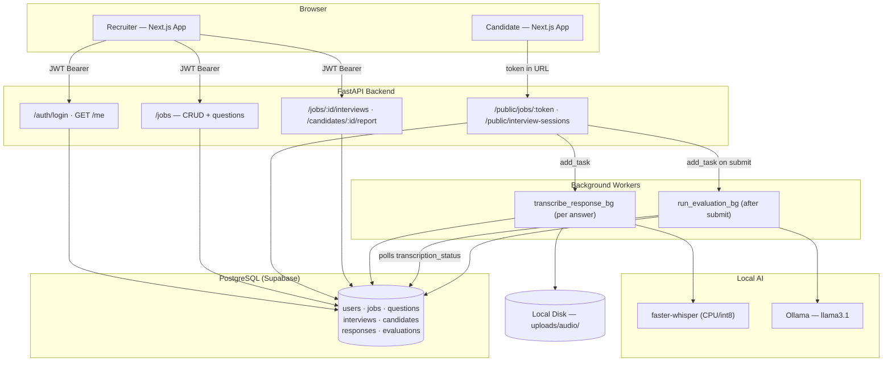

# Nodi

AI-powered asynchronous interview platform for recruiting. Candidates complete a structured voice-based screening through a unique link; the system transcribes answers, evaluates them against the job description, and generates an actionable report for the recruiter.

---

## Overview

Two user types interact with the platform:

- **Recruiter** — authenticated. Creates jobs, generates AI-suggested interview questions, shares a public link, and reviews AI-generated candidate reports.
- **Candidate** — unauthenticated. Opens a public link, fills in contact info, records voice answers, and submits. No account required.

The core pipeline is fully automatic: audio upload → background transcription (Whisper) → background evaluation (Ollama) → recruiter report.

---

## Tech Stack

| Layer | Technology |
|---|---|
| Frontend | Next.js 16, React 19, TypeScript, Tailwind CSS 4 |
| Backend | FastAPI, SQLAlchemy 2, Alembic, Pydantic v2 |
| Database | PostgreSQL (Supabase) |
| Transcription | faster-whisper — local, CPU, int8 quantization |
| LLM | Ollama — llama3.1, local |
| Auth | JWT (python-jose) + bcrypt |

---

## Architecture



---

## Key Technical Decisions

### 1. Reusable public job links over per-candidate invitations

Every active job gets a permanent `public_token` (e.g. `/interview/senior-engineer-7Kfs92`). Any candidate who opens the link fills in their contact info and receives a private session token. This eliminates the recruiter friction of manually generating and sending a unique link per person.

### 2. Session-based interview flow

An `InterviewSession` row decouples the candidate's progress from any invitation record. Sessions carry their own token, status machine (`started → in_progress → submitted → completed`), and lifecycle. This also allows the same candidate to resume an in-progress session from a new device.

### 3. Tokens stored as hashes only

Raw session tokens are never persisted in the database — only their SHA-256 digest. The raw token is sent to the candidate exactly once (in the `start` response) and is not recoverable from the DB. This follows the same pattern used for password reset tokens and API keys.

### 4. All AI runs locally — no external APIs

Both transcription (faster-whisper) and evaluation (Ollama/llama3.1) run on the host machine. There is no per-call cost, no candidate data leaving the system, and no third-party service dependency for the core ML features.

### 5. Non-blocking audio pipeline via BackgroundTasks

`submit_response` returns HTTP 201 immediately after saving the `.webm` to disk. Transcription runs off the request path in FastAPI's thread-pool. Candidate upload latency is independent of Whisper inference time, which can take 10–30 seconds on CPU.

### 6. Evaluation auto-triggers on interview submission

`submit_interview` fires `run_evaluation_bg` as a background task. The evaluator polls `transcription_status` every 5 seconds (max 5-minute wait) before calling Ollama. The candidate sees a "done" screen immediately; the recruiter sees a completed report when they return to the dashboard.

### 7. Structured, explainable AI output

The LLM is prompted to return a strict JSON schema: `overall_score` (0–100), `recommendation` (advance / hold / reject), `seniority_level`, `confidence_level`, `strengths`, `gaps`, `risks`, and a `criteria` array with 5 named dimensions (Technical Match, Communication Clarity, Problem Solving, Culture Fit, Seniority Alignment), each with a score 1–5, reasoning, and evidence quotes pulled from the transcript. Opaque scores without evidence are rejected by design.

### 8. Voice-only, no video

Assessment value comes from answer content. Video adds storage and processing complexity and introduces potential bias vectors (appearance, background, equipment quality) that are irrelevant to the screening goal.

### 9. Candidates are not users

Candidates have no accounts and never authenticate. Their data lives in the `candidates` table, not `users`. The auth surface stays minimal and candidate friction stays low — opening a link is the only entry point.

### 10. Client-side filtering for cross-job views

The Candidates, Interviews, and Reports pages call `getAllSessions()`, which fetches all jobs in parallel and flattens sessions client-side with job metadata attached. This avoids a dedicated aggregation endpoint at MVP scale and keeps each page independently filterable without extra API round-trips.

---

## Database Schema

| Table | Purpose |
|---|---|
| `users` | Recruiter accounts (JWT auth) |
| `jobs` | Job postings with `public_token` and `status` |
| `interview_questions` | Ordered question set per job |
| `candidates` | Contact info collected at interview start |
| `interview_sessions` | One session per candidate+job attempt; holds `session_token_hash` |
| `interview_responses` | One row per question answer; holds audio path, transcript, `transcription_status` |
| `interview_evaluations` | One row per session; holds full `evaluation_data` JSONB, `overall_score`, `recommendation` |

---

## Running Locally

### Prerequisites

- Python 3.11+
- Node.js 20+
- PostgreSQL (or a Supabase project)
- [Ollama](https://ollama.com) installed and running
- `ffmpeg` installed (`sudo apt install ffmpeg` / `brew install ffmpeg`)

### 1. Clone and set up the backend

```bash
cd backend
python -m venv .venv && source .venv/bin/activate
pip install -r requirements.txt
cp .env.example .env   # fill in DATABASE_URL and SECRET_KEY
```

### 2. Run database migrations

```bash
alembic upgrade head
```

### 3. Pull the LLM model

```bash
ollama pull llama3.1
```

The faster-whisper `base` model (~140 MB) downloads automatically on first transcription request.

### 4. Start the backend

```bash
uvicorn app.main:app --reload --port 8000
```

API docs available at `http://localhost:8000/docs`.

### 5. Set up and start the frontend

```bash
cd frontend
npm install
```

Create `frontend/.env.local`:

```
NEXT_PUBLIC_API_URL=http://localhost:8000
```

```bash
npm run dev
```

Frontend runs at `http://localhost:3000`.

---

## Environment Variables

Copy `backend/.env.example` and fill in:

| Variable | Description |
|---|---|
| `DATABASE_URL` | PostgreSQL connection string |
| `SECRET_KEY` | JWT signing secret — use a strong random value |
| `ACCESS_TOKEN_EXPIRE_MINUTES` | Token lifetime (default: 480) |
| `STORAGE_BUCKET` | Storage bucket name (default: `nodi-audio`) |
