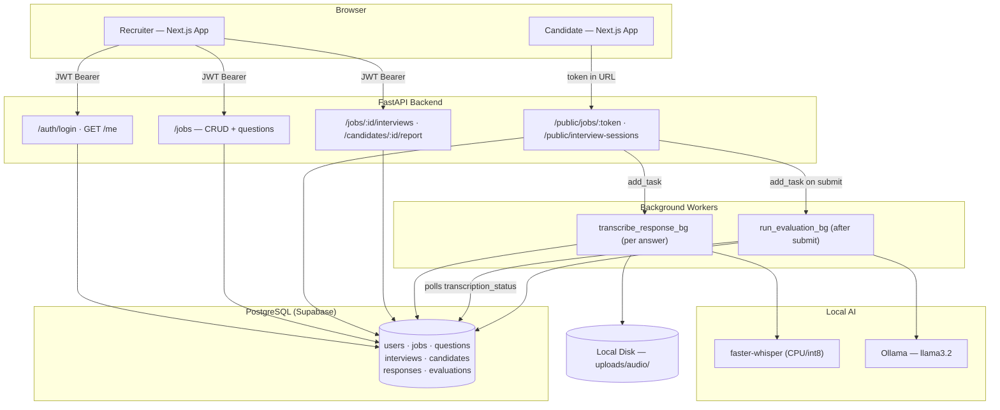
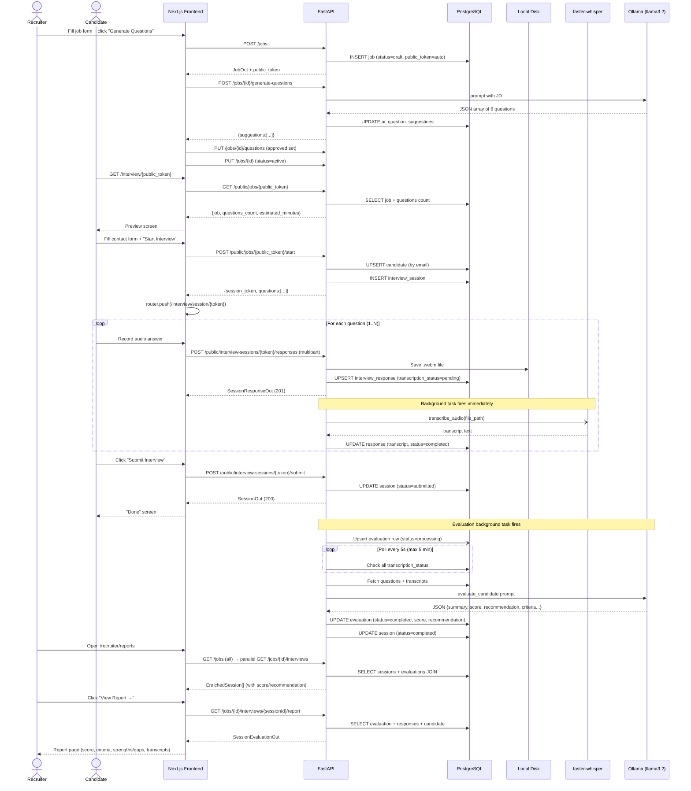

# Nodi — Architecture & Sequence Diagrams

## Architecture Diagram

```mermaid
graph TB
    subgraph Browser
        R["Recruiter — Next.js App"]
        C["Candidate — Next.js App"]
    end

    subgraph "FastAPI Backend"
        AUTH["/auth/login · GET /me"]
        JOBS["/jobs — CRUD + questions"]
        PUBLIC["/public/jobs/:token · /public/interview-sessions"]
        PRIV["/jobs/:id/interviews · /candidates/:id/report"]
    end

    subgraph "Background Workers"
        TBG["transcribe_response_bg (per answer)"]
        EBG["run_evaluation_bg (after submit)"]
    end

    subgraph "Local AI"
        WHISPER["faster-whisper (CPU/int8)"]
        OLLAMA["Ollama — llama3.2"]
    end

    subgraph "PostgreSQL (Supabase)"
        DB[("users · jobs · questions\ninterviews · candidates\nresponses · evaluations")]
    end

    FS[("Local Disk — uploads/audio/")]

    R -->|JWT Bearer| AUTH
    R -->|JWT Bearer| JOBS
    R -->|JWT Bearer| PRIV
    C -->|token in URL| PUBLIC

    AUTH --> DB
    JOBS --> DB
    PUBLIC --> DB
    PRIV --> DB

    PUBLIC -->|add_task| TBG
    PUBLIC -->|add_task on submit| EBG

    TBG --> WHISPER
    TBG --> DB
    TBG --> FS

    EBG -->|polls transcription_status| DB
    EBG --> OLLAMA
    EBG --> DB
```

---

## Sequence Diagram — Full Happy Path

```mermaid
sequenceDiagram
    actor Recruiter
    actor Candidate
    participant FE as Next.js Frontend
    participant API as FastAPI
    participant DB as PostgreSQL
    participant Disk as Local Disk
    participant Whisper as faster-whisper
    participant Ollama as Ollama (llama3.2)

    %% ── Recruiter creates job ──
    Recruiter->>FE: Fill job form + click "Generate Questions"
    FE->>API: POST /jobs
    API->>DB: INSERT job (status=draft, public_token=auto)
    API-->>FE: JobOut + public_token
    FE->>API: POST /jobs/{id}/generate-questions
    API->>Ollama: prompt with JD
    Ollama-->>API: JSON array of 6 questions
    API->>DB: UPDATE ai_question_suggestions
    API-->>FE: {suggestions:[...]}
    FE->>API: PUT /jobs/{id}/questions (approved set)
    FE->>API: PUT /jobs/{id} (status=active)

    %% ── Candidate opens link ──
    Candidate->>FE: GET /interview/{public_token}
    FE->>API: GET /public/jobs/{public_token}
    API->>DB: SELECT job + questions count
    API-->>FE: {job, questions_count, estimated_minutes}
    FE-->>Candidate: Preview screen

    Candidate->>FE: Fill contact form + "Start Interview"
    FE->>API: POST /public/jobs/{public_token}/start
    API->>DB: UPSERT candidate (by email)
    API->>DB: INSERT interview_session
    API-->>FE: {session_token, questions:[...]}
    FE->>FE: router.push(/interview/session/{token})

    %% ── Candidate records answers ──
    loop For each question (1..N)
        Candidate->>FE: Record audio answer
        FE->>API: POST /public/interview-sessions/{token}/responses (multipart)
        API->>Disk: Save .webm file
        API->>DB: UPSERT interview_response (transcription_status=pending)
        API-->>FE: SessionResponseOut (201)
        Note over API,Whisper: Background task fires immediately
        API-)Whisper: transcribe_audio(file_path)
        Whisper-->>API: transcript text
        API->>DB: UPDATE response (transcript, status=completed)
    end

    %% ── Submit ──
    Candidate->>FE: Click "Submit Interview"
    FE->>API: POST /public/interview-sessions/{token}/submit
    API->>DB: UPDATE session (status=submitted)
    API-->>FE: SessionOut (200)
    FE-->>Candidate: "Done" screen
    Note over API,Ollama: Evaluation background task fires
    API-)DB: Upsert evaluation row (status=processing)
    loop Poll every 5s (max 5 min)
        API->>DB: Check all transcription_status
    end
    API->>DB: Fetch questions + transcripts
    API->>Ollama: evaluate_candidate prompt
    Ollama-->>API: JSON {summary, score, recommendation, criteria...}
    API->>DB: UPDATE evaluation (status=completed, score, recommendation)
    API->>DB: UPDATE session (status=completed)

    %% ── Recruiter views report ──
    Recruiter->>FE: Open /recruiter/reports
    FE->>API: GET /jobs (all) → parallel GET /jobs/{id}/interviews
    API->>DB: SELECT sessions + evaluations JOIN
    API-->>FE: EnrichedSession[] (with score/recommendation)
    Recruiter->>FE: Click "View Report →"
    FE->>API: GET /jobs/{id}/interviews/{sessionId}/report
    API->>DB: SELECT evaluation + responses + candidate
    API-->>FE: SessionEvaluationOut
    FE-->>Recruiter: Report page (score, criteria, strengths/gaps, transcripts)
```
